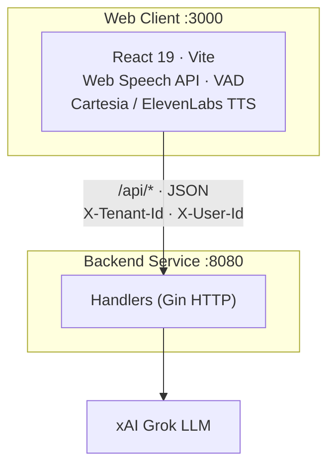
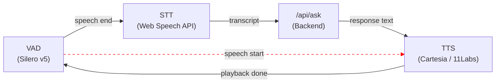
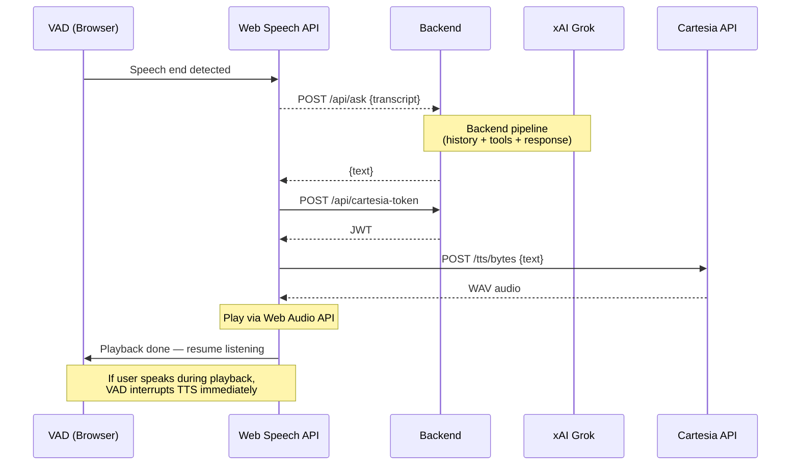

# Web Client — Design Document

**Source:** Extracted from `alex-architecture_v1.md` (2026-03-24)
**Scope:** React single-page chat client for the ElderNexus caregiving platform

---

## 1. Overview

The web client is a voice-first conversational UI for a caregiving platform. A care recipient (or caregiver on their behalf) speaks or types to an LLM-powered assistant. The client is a standalone React SPA that talks to a Go backend service over JSON HTTP; the backend fronts the xAI Grok LLM, PostgreSQL, and Redis.



---

## 2. Technology Stack

| Concern | Technology |
|---|---|
| Framework | React 19 |
| Build tool | Vite 7 |
| Speech-to-text | Web Speech API (browser-native) |
| Voice activity detection | @ricky0123/vad-web (Silero VAD v5, ONNX) |
| TTS (primary) | Cartesia REST API |
| TTS (alternative) | ElevenLabs WebSocket streaming |
| Markdown rendering | react-markdown |
| Styling | Plain CSS |

---

## 3. Application Structure

The client is a single-page chat interface with no routing. All UI logic lives in one `App.jsx` component (~485 lines).

```
webclient/
├── index.html           # Root HTML
├── main.jsx             # React entry point (StrictMode)
├── App.jsx              # Monolithic chat component
├── App.css              # All styles
├── tts-cartesia.js      # Cartesia TTS integration (REST)
├── tts-elevenlabs.js    # ElevenLabs TTS integration (WebSocket)
├── stripMarkdown.js     # Markdown → plain text for TTS
└── vite.config.js       # Dev proxy, VAD asset copying
```

---

## 4. State Management

Local React hooks only — no global state library, no Context.

| State | Type | Purpose |
|---|---|---|
| `messages` | Array | Chat history `[{role, text}]` |
| `input` | String | Current text input |
| `loading` | Boolean | Waiting for API response |
| `isRecording` | Boolean | STT recording active |
| `recordingTime` | Number | Elapsed recording seconds |
| `voiceMode` | Boolean | Continuous voice conversation active |
| `isSpeaking` | Boolean | TTS playback in progress |

Refs are used for non-rendering state: Web Speech API instance, VAD instance, TTS session, timers, and processing locks.

**No persistence** — messages are lost on page refresh. Redis chat history on the backend is the durable store.

---

## 5. Voice Pipeline

The client supports three voice interaction modes:

### 5.1 Simple Recording
1. User taps mic button
2. Web Speech API captures and transcribes continuously
3. Transcript populates the text input field
4. User reviews and taps send (or cancels)

### 5.2 Voice Mode (Continuous Conversation)

Full hands-free loop:



- **VAD detects speech end** → auto-submits transcript to backend
- **VAD detects speech start** → interrupts TTS playback (red dashed line)
- **VAD** (Silero v5 ONNX model) runs in a Web Worker — detects speech start/end locally
- **STT** — Web Speech API transcribes continuously; submitted automatically when VAD signals speech end
- **Processing lock** prevents concurrent submissions
- **TTS** plays the response audio; interrupted if user starts speaking again

### 5.3 TTS Implementations

| Provider | Protocol | Flow |
|---|---|---|
| **Cartesia** (default) | REST | Get JWT from `/api/cartesia-token` → POST text to Cartesia API → decode WAV → play via Web Audio API |
| **ElevenLabs** | WebSocket | Get token from `/api/tts-token` → open WebSocket → stream text → receive base64 PCM chunks → queue and play sequentially |

Both strip markdown from responses before synthesis (`stripMarkdown.js`).

### 5.4 Voice Mode Sequence



---

## 6. API Integration

All requests go through the Vite dev proxy (`/api/*` → `localhost:8080`).

```
POST /api/ask
  Headers: { Content-Type: application/json, X-Tenant-Id: <uuid> }
  Body:    { "query": "..." }
  Response: { "text": "..." }

POST /api/cartesia-token   → JWT for Cartesia TTS
POST /api/tts-token        → Token for ElevenLabs TTS
```

**API keys never reach the browser** — TTS tokens are proxied through backend endpoints so the real Cartesia and ElevenLabs credentials stay server-side.

**Tenancy** — all requests carry `X-Tenant-Id` (UUID) and optionally `X-User-Id` headers. A Circle is the tenancy boundary (household/care network); data on the backend is circle-scoped.

---

## 7. UI Design

- **Layout:** Full-viewport flex column — header, scrollable message area, input bar
- **Messages:** Rounded bubbles; user messages dark, assistant messages light gray
- **Markdown:** Assistant responses rendered with `react-markdown`
- **Animations:** Typing dots (loading), listening pulse (green), speaking waves, voice button glow, recording waveform
- **Max width:** 720px centered — mobile-first
- **Accessibility:** ARIA labels on all interactive buttons

---

## 8. Build & Run

```bash
npm install     # first time
npm run dev     # dev server on :3000, proxies /api to :8080
npm run build   # production build
```

A running backend on `localhost:8080` is required for `/api/ask` and the TTS token endpoints.
